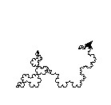

<h1>Koch curves </h1>

Fractals are very interesting curves in geometry  , not only they are in theoretical mathematics  but even in many fun things like deep dreams .
I am reading "Think python by Allen Downey"  , i got an excercise about koch curves using turtle .I got excited and build it . But i was more 
curious to mix fractals and random numbers(Collatz conjecture(again!)) . I wrote this program . It is very fun programme to run & it needs some patience.
 <b>Caution</b>: Calculate Collatz cycles before giving an input . Do not try number like 27 .(70 cycles)
 Below is an image  of pattern generated with input =23. 
 

